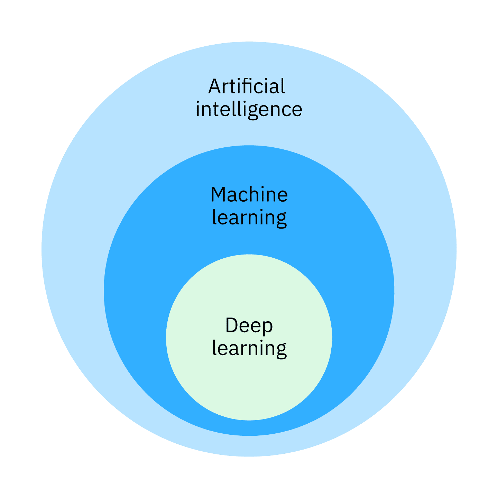

# Intro to Machine Learning

## Apa Itu Machine Learning?

Menurut Google, ML is the **process of training** a piece of software, called a **model**, to make useful **predictions** or generate content (like text, images, audio, or video) from data. 

Atau jika kita terjemahkan, ML adalah **proses melatih** sebuah software, yang disebut **model**, untuk membuat **prediksi** yang berguna atau membuat konten (seperti teks, gambar, audio, atau video) dari data.

Kata kuncinya terletak di: proses melatih, model, dan prediksi. Yang mana, berarti machine learning itu proses untuk melatih model itu.

### Apa Itu Model?
Adapun model itu simpelnya, hasil belajar yang sudah disimpan, dari semua pola yang dipelajari dari data, kemudian dikemas menjadi sesuatu yang bisa langsung dipakai untuk memprediksi hal baru nantinya.

Dalam supervised ML: Model akan mengambil contoh sebagai input, kemudian menyimpulkan prediksi sebagai output.

Adapun dalam unsupervised ML: model akan memetakan contoh input ke kelompok yang paling sesuai.


#### Bagaimana cara kita memahami pengertian model menurut Google?

Menurut Google, model secara umum adalah konstruksi matematika apa pun yang memproses data input dan menampilkan output. Singkatnya, model adalah **struktur + kumpulan parameter** yang bekerja sama untuk membuat prediksi.

Konkretnya, model itu dasarnya kayak rumus matematika dengan variabel yang belum diisi:
> harga = (a × luas) + b

Strukturnya sudah ada. Tapi nilai a dan b (yang disebut parameter atau bobot) itu masih kosong alias random di awal.

Nah, proses **melatih model** maksudnya adalah mencari nilai a dan b yang paling pas, supaya prediksinya akurat.

Misalnya, setelah training, mesin menemukan bahwa **a = 5 juta** dan **b = 10 juta**. Maka, kalau ada user minta prediksi harga rumah 200m^2, mesin tinggal masukkan ke rumus aja:

> harga = (5.000.000 × 200) + 10.000.000 = Rp1.010.000.000

Nah di sini, model sebelum dan sesudah training bukan model yang berbeda. Strukturnya sama, tapi parameternya sudah terisi optimal.

> **Penting untuk dicatat!**
> 
> Parameter tidak berdiri sendiri. Nilai a = 5 juta tidak ada artinya tanpa tahu ia masuk ke rumus mana.
> Makanya, ``model = struktur + parameter``, keduanya adalah satu kesatuan yang tak terpisahkan.

Agar model tersebut dapat tetap relevan seiring waktu, ia perlu terus dilatih ulang dengan data baru. Proses inilah yang disebut sebagai machine learning.

So, melatih model itu maksudnya menyesuaikan parameter sampai hasil prediksinya seakurat mungkin. Dan itu semua dilakukan otomatis dengan matematika, bukan manual satu per satu. Inilah yang menyebabkan machine learning tampak ajaib.

## Lalu, apa itu Artificial Intelligence?

Istilah AI sebenarnya kembali kepada kemampuan sistem atau mesin untuk mempelajari pola dan membuat sebuah prediksi. AI tidak akan menggantikan manusia dalam membuat sebuah keputusan, tetapi AI dapat membantu meningkatkan value dalam keputusan manusia.

### Apa yang AI Lakukan?

AI sebenarnya ga mikir kayak manusia. Dia ga punya kesadaran, perasaan, intuisi. Yang dia lakukan sebenarnya hanya operasi matematika (tambah, kurang, bagi, turunan, probabilitas, dll), tapi dalam skala yang lebih cepat dan masif. Kesannya pintar karena hasilnya menakjubkan, tapi di balik itu sebenarnya murni angka.

Nah, walau begitu, sebenarnya AI itu punya level2 sendiri. Ada yang level biasa, hanya berdasarkan aturan yang sudah diatur (rule based). Ada juga yang dia bisa belajar sendiri, inilah yang sering kita dengar sebagai machine learning. Ada juga yang strukturnya niru otak manusia, ini deep learning.

Machine learning, ia belajar dari pengalaman. Semakin banyak dan bagus data yang masuk, akan semakin bagus performanya. Dia tidak menggunakan aturan yang hardcode seperti rule based. Akan tetapi, dia akan mengupdate sendiri berdasarkan data terbaru.

Adapun deep learning, dia lebih dalam. Cara kerjanya terinspirasi dari otak manusia. Para ilmuwan niru struktur ini secara matematis, namanya neural network. Ia akan mengkalkulasi secara bertingkat dengan berbagai level. Bayangannya seperti data masuk, diproses di layer 1, hasilnya lanjut ke layer 2, dst. Tiap layer nangkep pola yang makin kompleks. Semakin banyak layer yang digunakan, semakin dalam pemahamannya, makanya ia disebut deep learning.



Supaya semakin tergambar, perbedaan tingkatannya, coba kita pakai skenario berikut:

Situasi awal: kita kerja di toko buah. Di sana, ada 3 kategori buah:

- 🍑 Stone fruits → persik, ceri
- 🍓 Berries → stroberi, blueberry
- 🥭 Tropical → mangga, nanas

**Artificial Intelligence**

Kita bikin aturan manual berdasarkan label di kemasan:

```python
if "berry" ada di label → keranjang kiri
if "tropical" ada di label → keranjang kanan
else → keranjang tengah
```

Mesin bakal baca tulisan di label, kemudian mencocokkan dg aturan, dan selesai.

Kemudian, masalah baru datang. Datang kiriman buah baru, blackberry. Labelnya cuma blackberry, gaada tulisan berry nya. Walhasil, mesin bakal salah masukinnya, malah jadi ke stone fruits. So, kita harus perbaiki labelnya dulu atau aturannya supaya sortirnya bisa benar.

Ini adalah salah satu gambaran contoh bentuk artificial intelligence, yang mana menggunakan level yang rendah, yaitu rule based.

**Machine Learning**

Supaya ga ribet harus update terus setiap ada jenis buah baru, akhirnya kita kasih mesin ribuan foto buah lengkap sama jawabannya.

Misal: foto ini = stroberi = berry. foto ini = mangga = tropical. dst.

Dari situ, mesin mulai belajar sendiri. Dia bakal perhatiin pola2 kayak:

- Berry itu kecil, bulat, warnanya gelap/merah
- Tropical itu besar, kulitnya tebal
- Stone fruit itu ukurannya medium, bentuknya oval/bulat, kulitnya mulus

Tapi, kita masih harus kasih tau mesin, yang perlu kita perhatiin itu warna, ukuran, tekstur kulit. Kita yang harus tentuin variabel apa aja yang relevan (ini yang namanya feature extraction). Di sini masih melibatkan kerja manusia.

Hasilnya akan lebih baik daripada sekedar if else karena mesin masih bisa mengenali blackberry meskipun labelnya beda, selama ia pernah lihat fotonya saat training.

**Deep Learning**

Toko semakin berkembang. Sekarang, makin banyak buah baru:

- Nektarin & plum (stone fruits baru)
- Blackberry & cranberry (berries baru)
- Star fruit & durian (tropical baru)

Plus semua buah ini dateng dalam berbagai ukuran, warna matang yang beda-beda, ada yang kulitnya mulus ada yang berbintik.

Kalau pakai ML biasa, kita harus duduk dan mikirin: "hmm, variabel apa lagi yang yang perlu kita tambahin?", ini makin lama makin ribet. Dengan Deep Learning, kita tinggal masukin aja ribuan foto buah ke sistem, dan neural network bakal proses sendiri lewat layer2:

- Layer 1 → deteksi tepi, garis, tekstur kasar
- Layer 2 → dari bentuk, bulat, lonjong, ada lekukan
- Layer 3 → pola lebih kompleks lagi, apakah kulitnya berduri?
- Layer 4 → kesimpulan final: "oh ini stone fruit"

Kita ga perlu bilang apapun. Mesin sendiri yang bakal ngenali variabel apa aja yang bakal pengaruh, contoh: warna, bentuk, tekstur. Bahkan mungkin dia bisa nemuin pola yang malah kita belum kepikiran.

**Analogi Lainnya**

- AI: kita kasi resep, mesin masak sesuai resep. Bahan baru? Resep harus ditulis
- ML: kita tunjukin aja ratusan masakan, kita bilang yang mana yang enak, yang mana yang ngga. Mesin lama2 ngerti selera kita. Tapi kita masi harus ngasi tau aspek2nya, coba perhatiin rasa, aroma, tampilan, dst
- DL: kita tunjukin aja masakan ratusan kali, mesin sendiri yang bakal cari tahu sendiri kenapa sesuatu enak, kenapa engga, tanpa kita jelasin apapun

**Pada Intinyaa...**

Apapun yang AI lakukan, baik rule based, maupun deep learning, ujung2nya bakal balik ke dua hal yaitu **analisis** dan **prediksi**. AI bakal nganalisis data yang kita kasi, dan bakal ngolah jadi prediksi. Bahkan kalau kita coba buka di skala besar pun, ujung2nya juga ke dua itu: Spotify analisis lagu yang kita dengerin, dia bakal hasilin prediksi lagu apa yang kita suka.

---

## Lain - Lain
### To Do List
- [ ] Apa bedanya parameter dan hyperparameter?
- [ ] Kenapa model bisa "salah" meskipun sudah ditraining

### Referensi
- [Machine Learning Learning Course by Google](https://developers.google.com/machine-learning/intro-to-ml/what-is-ml?hl=id)
- [Guide to Machine Learning 2026 by IBM](https://www.ibm.com/id-id/think/machine-learning)
- [What Is Machine Learning - Amazon AWS](https://aws.amazon.com/what-is/machine-learning/)
- [What Is Machine Learning - Google Cloud](https://cloud.google.com/learn/what-is-machine-learning)
- [What Is Machine Learning - Datacamp](https://www.datacamp.com/blog/what-is-machine-learning)